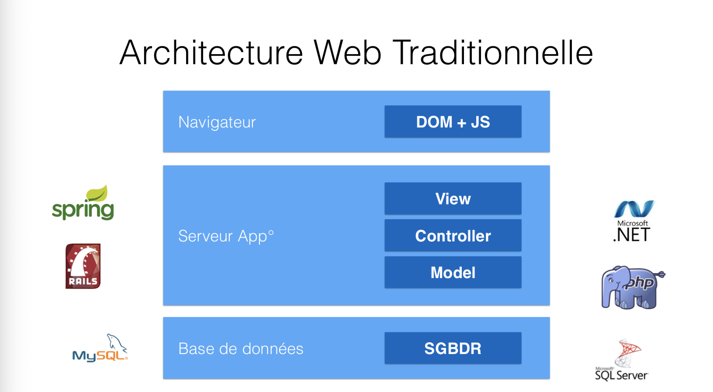
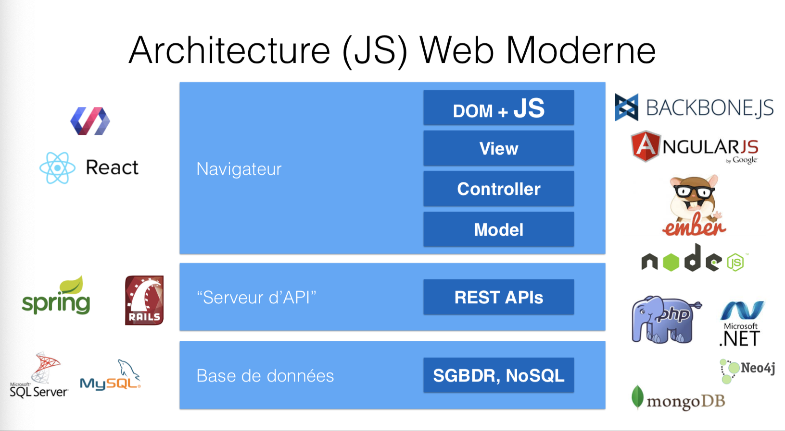
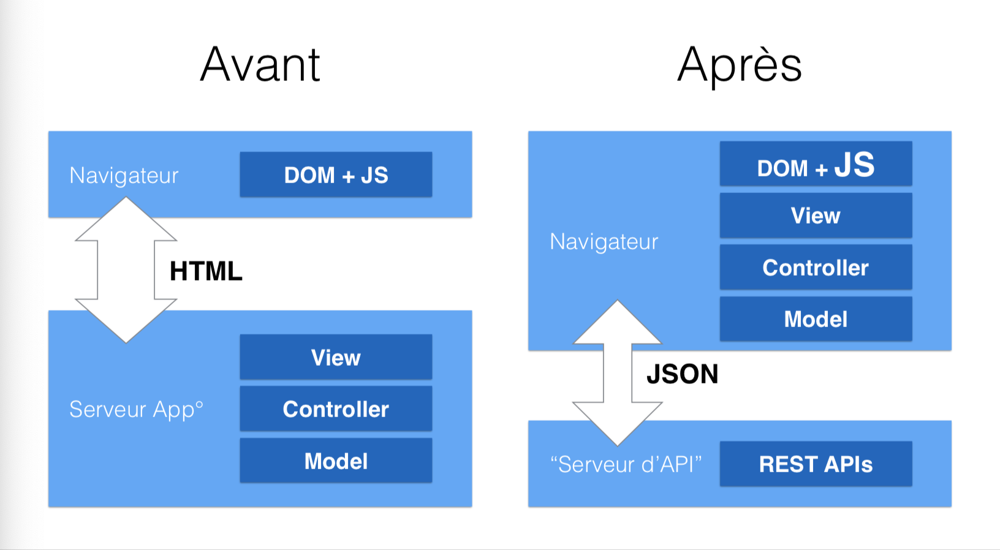
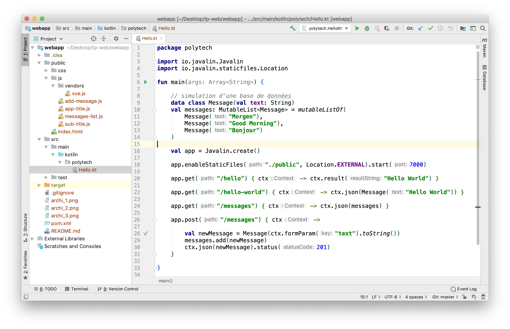
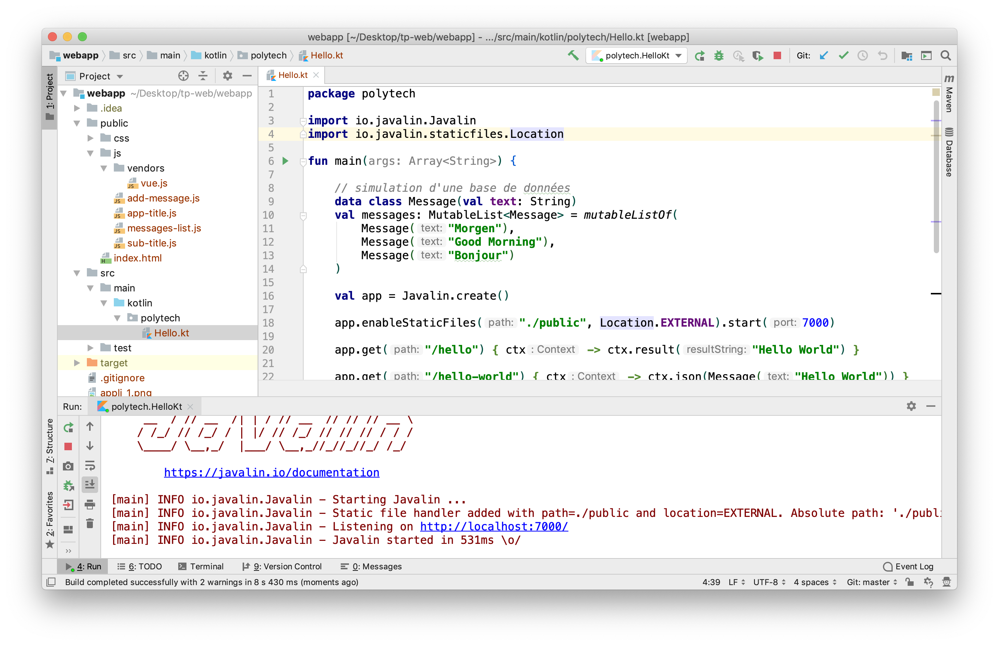
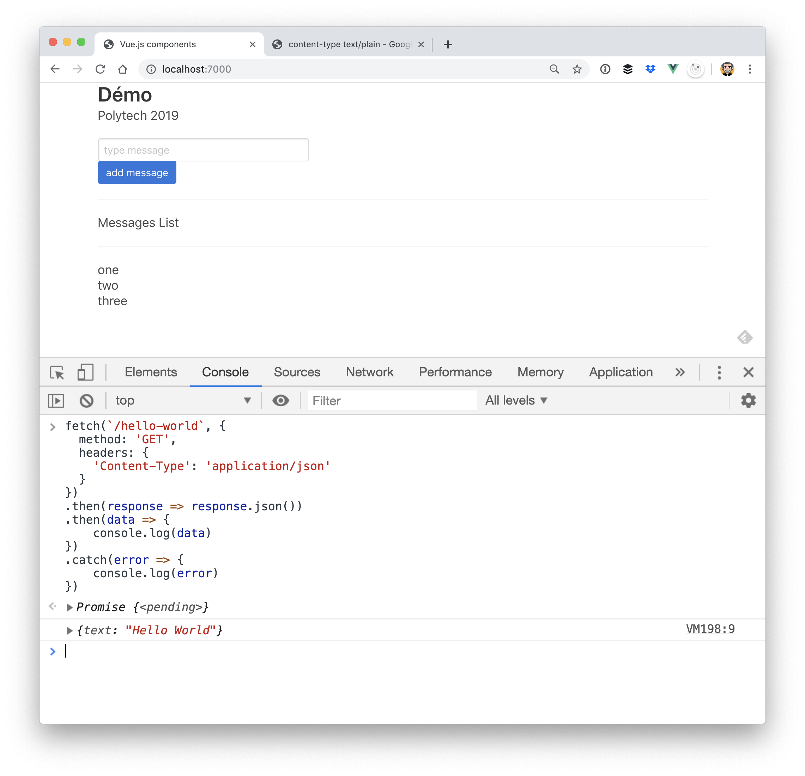

# TP Web

## Un peu d'histoire

- 1995: Création de JavaScript
- 1996: Netscape Navigator 2 avec le support de JavaScript
- 1997: `<iframe> IE3 ou 4`
- 1998: Rhino Engine - Java
- 1999: ActiveX XMLHTTP IE5 
- 2000: XMLHttpRequest > Gecko (moteur JS de Mozilla)
- 2004-2005: XMLHttpRequest == Standard "de fait"
- 2004: GMail
- 2005: Google Map
- 2008: Google V8 engine
- 2009: Node.js
- 2010: (Avril) Steve Jobs "tue" Flash
- Apparition de nombreux frameworks JavaScript
- ...

## "Architectures"







## Lancer l'application du projet

Le framework utilisé est Javalin (utilisable en Java et Kotlin): [https://javalin.io/](https://javalin.io/)

> Ouvrir le projet



> Exécuter le projet



## Lancer un navigateur

> - aller sur [http://localhost:7000](http://localhost:7000) et ouvrir la console

Essayer le code suivant dans la console:

```javascript
fetch(`/hello`, {
  method: 'GET',
  headers: {
    'Content-Type': 'text/plain'
  }
})
.then(response => response.text())
.then(data => {
	console.log(data)
})
.catch(error => {
	console.log(error)
})
```

> vous avez appelé le code serveur suivant
```kotlin
app.get("/hello") { ctx -> ctx.result("Hello World") }
```


Essayer le code suivant dans la console:

```javascript
fetch(`/hello-world`, {
  method: 'GET',
  headers: {
    'Content-Type': 'application/json'
  }
})
.then(response => response.json())
.then(data => {
	console.log(data)
})
.catch(error => {
	console.log(error)
})
```

> vous avez appelé le code serveur suivant
```kotlin
app.get("/hello-world") { ctx -> ctx.json(Message("Hello World")) }
```


> **Remarques**: 

Pour ajouter un message (et donc appeler l'API de type `POST`):

```javascript
fetch(`/messages`, {
  method: 'POST',
  headers: {
    "Content-Type": "application/x-www-form-urlencoded",
  },
  body: "text=Hello!!!"
})
.then(response => response.json())
.then(data => {
	console.log(data)
})
.catch(error => {
	console.log(error)
})

```




## Web Appalication (Front)

- c'est une application Vue
- parcourir ensemble les fichiers

### Faire communiquer les composants

> envoyer un message:

```javascript
this.$root.$emit("add-message", this.message)
```

> s'abonner à un message

```javascript
this.$root.$on("add-message", (message)=> {
    this.messages.push(message)
})
```

## Exercice 1:

Modifiez l'application côté front pour utiliser la "pseudo" base de données:

```kotlin
data class Message(val text: String)
val messages: MutableList<Message> = mutableListOf(
    Message("Morgen"),
    Message("Good Morning"),
    Message("Bonjour")
)
```

## Exercice 2:

Transformez/Cassez l'application pour créer un Kebab

## Exercice 3:

Donnez la possibilité de supprimer les ingrédients du Kebab

## Exercice 4:

Si il reste du temps, mettre en place un système d'authentification (juste pour un seul user==administrator) à base de JWT

- côté serveur: 
  - génération du token
  - vérification des appels de l'api
- côté navigateur
  - créer le formulaire de login et récupérer le token
  - enregistrer le token dans le local storage
  - utiliser le token avec les requêtes http

> Ressources:
> - https://javalin.io/2018/09/11/javalin-jwt-example.html


> Code JavaScript pour s'authentifier et demander un token:
```javascript
fetch(`/admin/login`, {
    method: 'POST',
    headers: {
      'Content-Type': 'application/json',
    },
    body: JSON.stringify({
      name: name, pwd: pwd
    }), // body data type must match "Content-Type" header
})
.then(response => {
  return response.json()
})
.then(data =>  {
  if(!data.token) {
    window.localStorage.setItem('my_credentials', null)
  } else {
    window.localStorage.setItem('my_credentials', JSON.stringify({token:data.token, user:name}))
  }
})
.catch(error => {})
```

> Code JavaScript pour envoyer un token avec une requête:
```javascript
let credentials = JSON.parse(window.localStorage.getItem('my_credentials'))

let token = (credentials==null || credentials==undefined)
  ? null
  : credentials.token

return fetch(`/something`, {
  method: 'GET',
  headers: {
    'Content-Type': 'application/json',
    'token': token
  }
})
```
